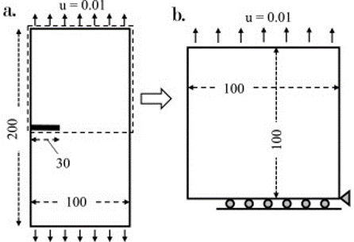
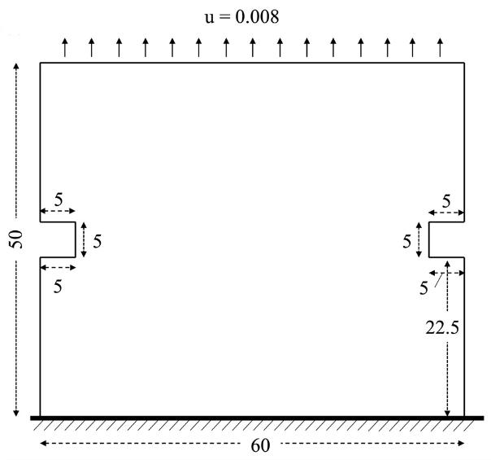
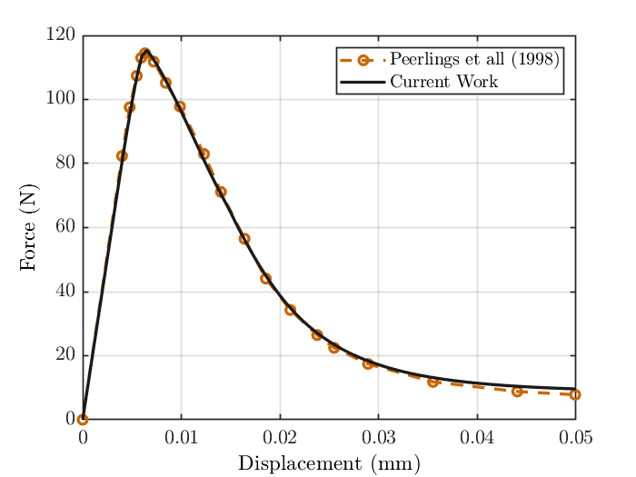
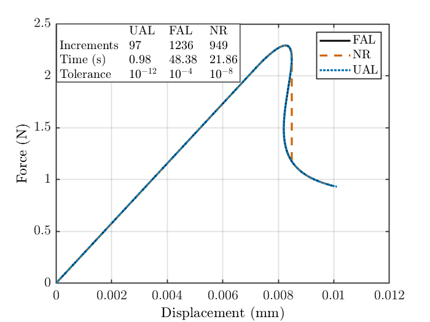
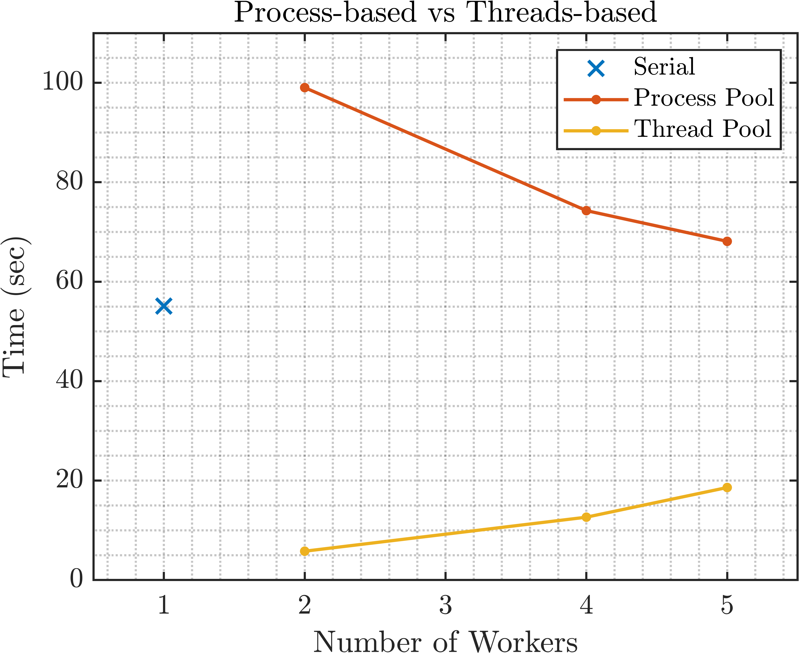
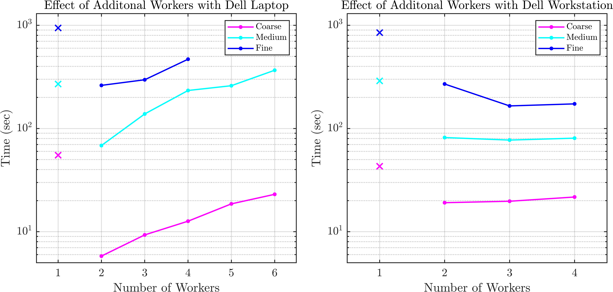
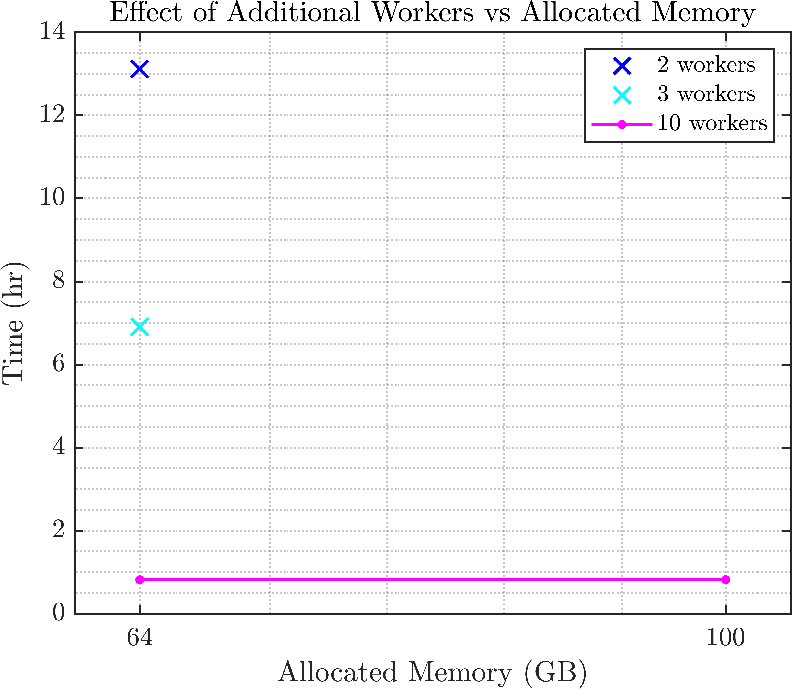

## I. Software Features

This code performs parallel‐based simulations of continuum damage mechanics problems. In its current formulation, the following features are available:

- The code models the performance of quasi‐brittle materials, and the user can select between two relevant damage models that capture such behavior: the Mazars [1] and the Geers [2] damage laws.
- The code performs quasi‐static simulations for 2D problems (plane‐strain or plane‐stress).
- The code supports the analysis of both structured and unstructured meshes, with quadrilateral elements that contain 4 Gauss points.
- Two numerical solvers are available, namely the Newton‐Raphson (NR) [3] and the Unified Arc‐Length (UAL) [4] methods.
- The code supports displacement‐driven analysis (Dirichlet BCs are imposed).
- The code can be run either in serial or parallel mode.

## II. Software Prerequisites

This code requires **MATLAB** and the **Parallel Computing Toolbox** to be installed. The code is compatible with MATLAB version **R2022b and later**. While we recommend using GMSH to generate a new mesh, the user can pick any relevant software of their choice. The generated mesh should be stored in a `.txt` file, modified by the user to match the format that is explained below (see the “IV. Model files structure” section).

## III. Code structure

The code is a compilation of several `.m` files. The main script is `FEM_Main_Script_2D.m`, which is the only code‐related file the user needs to open and edit. In this file the user specifies the <ins>working/saving directories</ins> (line 13) and the <ins>model name</ins> (line 16). This file then calls the solver (Newton‐Raphson or UAL) and the analysis starts.

Each file named `func____.m` serves a specific purpose, and a brief description of its functionality is provided at the beginning of the file. The overall code follows a typical FEM workflow (element‐level procedures, assembly to global matrices, solution for unknown degrees of freedom).

The analysis generates output data at each load increment, which are stored in the `Saved Files` folder. It also prints contour plots for damage, local strain, and nonlocal strain at the last load increment, which are stored in the `Images` folder.

## IV. Model files structure

Each model is fully defined in two `.txt` files: a mesh file (`modelName_mesh.txt`) and a parameter file (`modelName_parameters.txt`). The mesh file contains the definitions of:

- Nodal coordinates  
- Element connectivity  
- Imposed Dirichlet boundary conditions  

The parameter file contains several hyperparameters of the problem, and they are presented in detail below (see Section “VII. Details of parameter files”). **The parameter file must reference the associated mesh file.** This occurs at the last line of the parameter file, which links to the appropriate mesh file.

To facilitate the user’s understanding of the model files, we provide in the **"Test Problems"** folder the files for 4 sample cases: **Symmetric Single Notch Tension (SSNT)** with Coarse, Intermediate and Fine mesh resolution (following [5]), and a **Direct Tension Test** (Double‐notch) following Peerlings et al. [6]. The user should create files that follow the structure of these benchmarks.

### i.	Symmetric Single Notch Tension [5]

The SSNT test problem involves a mode-I loading scenario applied to a single-notch specimen. The geometry is illustrated in Fig. 1. Due to the problem's symmetry, only the upper half of the domain needs to be modeled and analyzed, as shown in Fig. 1b. A displacement is applied to the top boundary. Rollers are placed along the horizontal centerline of the intact domain to restrict the y-direction movement of those nodes. Additionally, the x-direction movement of the bottom-right node is constrained. [5]

 

_Figure 1. a) Geometry and boundary conditions for the symmetric single notch (SSNT) test. b) Upper half of the domain used due to symmetry._

### ii.	Direct Tension Test [6]

The 50 mm direct tension test involves a mode-I loading scenario applied to a double-notched specimen. The specimen geometry is depicted in Fig. 2. The lower boundary is fully restrained, and an upward displacement is applied at the top boundary. 

 

  
  
<em>Figure 2. Geometry and boundary conditions for the 50 mm direct tension test.
</em>

 

To validate the proposed methodology of the software, the direct tension test problem is tested and compared as seen in Figure 3. The close agreement between the two sets of results substantiates the accuracy and reliability of the present approach. 
 

  
  
<em>Figure 3. Force-displacement plot comparing the results from Peerlings et al. with our code using the UAL solver
</em>

## V. Running the code

In order for the user to implement our code on one of the provided benchmark problems (let us assume “SSNT_Coarse”), the following steps are required. The user needs to:

1. Ensure MATLAB and the Parallel Computing Toolbox are installed.
2. Download the `Code` and `Test Problems` folders.  
3. Open the `SSNT_Coarse_parameter.txt` file and adjust the parameters according to their desired setup (see “VII. Details of parameter files” for details).  
4. Ensure the correct mesh filename (`SSNT_Coarse_mesh.txt`) is referenced at the last line of the parameter file.  
5. Copy the mesh and parameter files from the `Test Problems` to the `Code` folder.  
6. Within the `Code` folder, create the `Saved Files` and `Images` folders.  
7. Open the `FEM_Main_Script_2D.m` file and update the following:  
   - `main_file_path` with the directory of the `Code` folder (line 13)  
   - `model_name` with the mesh file to run (line 16)  
8. Run the `FEM_Main_Script_2D.m`.

## VI. Details of parameter files
Here we summarize and briefly explain the primary parameters which are pertinent to the simulation, to facilitate the running and customization of each analysis. 

- `RoutineID`: specifies the non-linear solver. Values:  
  1 – for Unified ArcLength (UAL)  
  2 – for Newton-Raphson  

- `SolverID`: specifies whether a local or nonlocal damage theory is used. This variable must be consistent with the number of dofs/ per node, `No._DOF_per_node`. Values:  
  1 – for local damage (`No._DOF_per_node`: 2)  
  2 – for nonlocal gradient damage (`No._DOF_per_node`: 3)  

- `Scheme_ID`: this refers to the implementation scheme for UAL, according to [4]. Values:  
  1 – for Partitioned Consistent (PC) scheme  
  2 – for Partitioned Non-Consistent (PNC) scheme  

- `TangentID`: formulation of the Jacobian matrix. The current code supports the analytical version. Values:  
  1 – for analytical tangent  

- `Constraint_type`: For the UAL, it determines how the arc-length constraint is enforced. Values:  
  1 – for cylindrical (recommended)  
  2 – for spherical  

- `tolerance`: convergence criterion for the solver. For most continuum damage mechanics problems, a tolerance between `1e-4` – `1e-8` ensures a good accuracy-cost tradeoff. 

- `ST` (strain tolerance): additional tolerance specific to the UAL solver only, for controlling solution accuracy. Recommended range: `1e-5` to `1e-7`

- `max_failed_attempts`: maximum allowed number of failed increments (UAL only). 

- `direction_load`: this is the direction where the load is applied. Values:  
  1 – for X axis  
  2 – for Y axis

- `eq_strain_type`: this refers to the definition of the local equivalent strain. Values:  
  1 – for Mazars definition (principal strains)  
  2 – for shear strain  
  3 – for modified von Mises strain (in this case, `k_damage_parameter` is a control parameter relevant only here, with a recommended value is 10) 

- `Damage_type`: refers to the damage evolution law. Values:  
  1 – for Mazars damage law  
  2 – for Geers damage (only for nonlocal gradient damage) 

- `reaction_calc`: determines how boundary reactions are computed. Values:  
  1 – calculate reactions on homogeneous Dirichlet boundary condition [Default]  
  2 – calculate reactions on inhomogeneous (non-zero) Dirichlet boundary condition 

## VII. Tips for testing and improved performance

- If using UAL, experiment with different `Scheme_ID` options (PC or PNC), strain tolerance (`ST`) and arclength limits to identify the approach which best suits the problem’s convergence.
- For nonlocal gradient damage, the user must confirm that the associated length scale parameters and mesh refinements are appropriate to capture the damage gradient accurately.
- If the numerical solution doesn’t converge, consider adjusting `max_failed_attempts`, `tolerance`, or `ST` values to allow for better convergence behavior.
- Always verify that boundary conditions are correctly imposed, particularly if `reaction_calc = 2` (for non-zero Dirichlet boundaries).
- MATLAB parallelization can be run either as processes-based or thread-based. Our investigations have indicated that threads-based is optimal (see section X.ii.). so we have set it as the default in the code. To use the processes-based environment, the user should go to line 17 in the user inputs part of the “FEM_Main_Script_2D.m” file and replace 'Threads' with 'Processes'. The number of parallel threads to be used can be modified according to the available hardware capabilities of the user’s device (default: 3) and can be changed in the following line.

## VIII. Direct Tension Software Test

This test replicates the L = 50 mm configuration of the classical direct tension experiment presented in Peerlings et al. (1998). The mesh and parameter setup are found in the folder “Test Problems” as well as in the main code folder.

### i.	Purpose
The objective of this test is to ensure that the core functionalities of the software are working correctly and can be validated after any modification or extension. For instance, if a user decides to extend the code to 3D or implement new features, this benchmark serves as a regression test to confirm that the original functionality remains unaffected.
The test runs the simulation and checks the resulting force-displacement curve against a reference solution. The max force error and L2 norm between the two curves is calculated, and if the error falls within an acceptable error tolerance, the test is marked as "passed." 

### ii.	Required Files
Before running the test, the following files should be in the same directory as the main code:

- “Direct_Tension_Software_Test.m”: MATLAB script to execute the test
- “Direct_tension_test_mesh.txt”: Mesh and boundary condition definitions
- “Direct_tension_test_parameters.txt”: Simulation parameters
- “ref_fd_data.mat”: Reference force-displacement curve data

### iii.	Running the Test
- Open “Direct_Tension_Software_Test.m” and input the file path in " main_file_path 
- Open “FEM_Main_Script_2D.m” and set:
    - model_name = 'Direct_tension_test';
    - the code file path in Main_file_path

## IX. Additional Notes on Solver Performance, Parallel Environments, Devices, and Memory Effects

**Devices used for testing:**  
- **Laptop**: Dell G15 5511, 11th Gen Intel i7, 8 cores, 16GB RAM.
- **Workstation**: Dell Precision 5820, Intel Xeon W, 4 cores, 64GB RAM.
- **HPC**: NYUAD high-performance cluster, 400GB memory cap for runtime tests.

**Mesh size definitions:**  
- Coarse: 2601 elements  
- Medium: 6561 elements  
- Fine: 10201 elements

### i. Solver Performance (UAL vs FAL vs NR)
The Unified Arc-Length (UAL) solver demonstrates superior computational performance compared to both the traditional Newton-Raphson (NR) and force-controlled arc-length (FAL) solvers.
In a test on a 1D bar with a weakened region (Young’s modulus reduced by factor of 2) using a nonlocal gradient damage model [4]:

- The UAL solver traced the complete nonlinear equilibrium path in 0.98 seconds using 97 increments.
- In contrast, the FAL and NR solvers required 1–2 orders of magnitude more time and increments with a more relaxed convergence tolerance.

 

  
  
<em>Figure 4. Force–displacement and performance comparison for UAL, FAL, and NR.
</em>

 

UAL can trace equilibrium paths with snap-backs, making it a suitable solver for a wide range of scenarios, which NR cannot capture. We use the UAL solver for all results presented.
 

### ii. Parallel Execution Environments

MATLAB’s Parallel Computing Toolbox allows parallel execution in two distinct environments:

1. Thread-Based Environment (default in code)
    - Tasks run directly on shared data.
    - Faster than process-based due to minimal data duplication, especially for coarse-to-medium mesh sizes.
2. Process-Based Environment
    - Data is copied to separate memory locations for each task.
    - Overhead increases with memory use and mesh size. 
 

  
  
<em>Figure 5. Time for first 5 iterations of the `func_globalstiffness` function  in serial, parallel process based, and parallel thread-based runs using the UAL solver.
</em>

<ins>**Key finding:**<ins>
- On a coarse mesh, thread-based mode was 3–10× faster than serial, and 3–20× faster than process-based mode. We also observe that the thread-based environment demonstrates increasing time with more workers, and this is attributed to the coarse mesh where additional parallelization is unnecessary.

### iii. Device Comparison
The runtime of the code on the 3 devices is compared using the thread-based environment to demonstrate the scaling of computational savings at smaller mesh sizes, addressing the common issue of parallel code portability across different computing devices. The results are shown in Figure 5.

<ins>**Key findings:**<ins>
- We observe that the laptop is considerably faster than the workstation for the coarse mesh, but as the mesh size increases the workstation becomes more efficient. 
- We also observe from Figure 5 that with larger mesh sizes and additional threads, the memory is a limiting factor such that the workstation is more suitable than the laptop due to the larger memory capacity.
These trends reflect the importance of balancing mesh size, memory availability, and parallel worker count for optimal runtime efficiency.
 

  
  
<em>Figure 6. Time comparisons on Dell G15 and Workstation with coarse, medium, and fine mesh sizes using the UAL solver. Note that the fine mesh cannot run with more than 4 workers on these devices due to memory limitations.
</em>

### iv. Memory Effects on HPC

The following figures illustrate the time effect of adding more parallel resources on the Dell G15 laptop and the Dell workstation. We observe that there is a significant improvement from parallelization compared with serial computation regardless of the device, but the laptop demonstrates reduced efficiency with additional workers perhaps due to memory limitations. On the workstation, the larger memory allows additional parallel workers to improve the time even more with the medium and fine mesh sizes. On the coarse mesh, additional resources are not justified since the problem size is much smaller.

 

  
  
<em>Figure 7. Time for the first 5 iterations measured for all 3 mesh sizes on the Dell G15 laptop and Dell workstation with the UAL solver. Note that the serial runtime is represented by the x-markers, and the time data is represented on a logarithmic scale for clarity.
</em>

 

  
  
<em>Figure 8. For a super fine mesh with the UAL solver, the effect of additional workers is compared to increased memory allocation.
</em>

## X. Contributions, Support, and Reporting Issues

The current code version can benefit from a series of user contributions, which are most welcome. These include:  

- Extension to other element types (i.e. higher-order elements)  
- Extension to other non-linear solvers (i.e. force-controlled arc-length)  
- Extension to other damage or phase-field models  
- Extension to 3D problems  
- Extension to multi-physics considerations, combining damage with other phenomena (i.e. heat transfer)

For contributions, support, or to report an issue, users can open an issue on GitHub.
 

## References

[1] J. Mazars, (1986): “A description of micro-and macroscale damage of concrete structures”, *Engineering Fracture Mechanics*, 25 (5–6), 729–737.

[2] M. Geers, R. De Borst, W. Brekelmans, R. Peerlings (1998): “Strain-based transient-gradient damage model for failure analyses”, *Computer Methods in Applied Mechanics and Engineering*, 160 (1–2), 133–153.

[3] T.J. Ypma (1995): “Historical development of the Newton-Raphson method”, *SIAM Review*, 37(4), 531–551.

[4] R. P. Saji, P. Pantidis, M. E. Mobasher (2024): “A new unified arc-length method for damage mechanics problems”, *Computational Mechanics*, 1–32.

[5] P. Pantidis, M.E. Mobasher (2023): “Integrated Finite Element Neural Network (I-FENN) for non-local continuum damage mechanics”, *Computer Methods in Applied Mechanics and Engineering*, 404, 115766.

[6] R.H.J. Peerlings, R. de Borst, W.A.M. Brekelmans, M.G.D Geers (1998): “Gradient-enhanced damage modelling of concrete fracture”, *Mechanics of Cohesive-Frictional Materials*, 3, 323–342.
