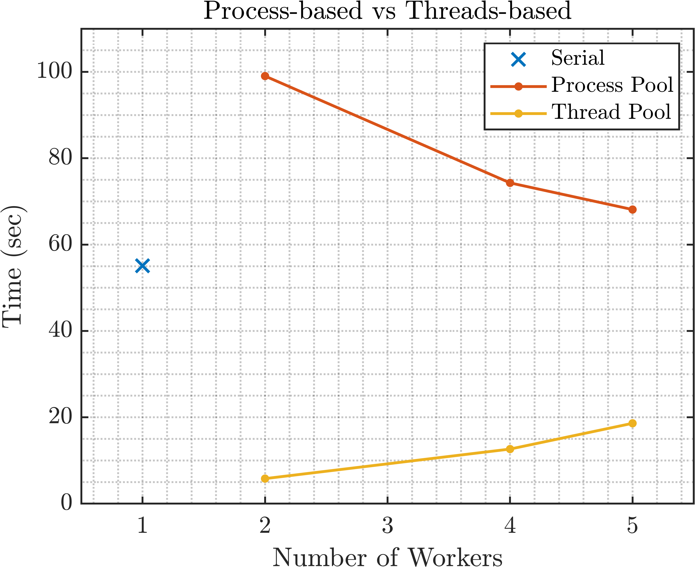

# Summary and Statement of Need
Modeling fracture in materials and structures holds immense importance in our efforts to understand how materials fail and hence design more fracture-resistant structures. Among the several theories developed over the last decades, continuum damage mechanics (CDM) studies the behavior of cracks in materials and structures from the viewpoint of continuous stiffness degradation as the crack propagates inside the domain [1]. CDM simulations are commonly implemented using the Finite Element Method, however the computational cost is notoriously elevated. Several remedies have been proposed to reduce this computational cost, including domain decomposition approaches [2] and adaptive refinement techniques [3]. Implementing parallel computing methods in CDM codes, where multiple computing resources are simultaneously used, is another promising but significantly less-explored avenue. Compared to the other approaches, very few resources are publicly available on this front, despite parallelization becoming increasingly widespread. With an increasing number of commercial electronic devices with multiple cores and threads, each capable of running its own instruction stream, there remains a major untapped potential for significant reductions in the computational expense. 
This open source code utilizes parallelization techniques for MATLAB in order to significantly accelerate CDM simulations. Building upon previous work by the authors, we develop a parallel version of the MATLAB code that was introduced in [4], and we demonstrate the additional efficiency over its serial counterpart. We address the common issue of parallel code portability across different computing devices, and we demonstrate the scaling of computational savings at smaller mesh sizes. The code is intended to be used both by researchers and students working with CDM.

# Methodology and Software Implementation
Pursuing potential acceleration of the code begins with identifying functions where parallelization is expected to yield significant computational gains. A flowchart of the code’s general functionality is shown in Fig. 1  \autoref{fig:general_flowchart}. The function on which we focus is the globalstiffness function, which calculates and assembles the global stiffness matrix, force vectors, and residual vector. The function also calculates the projection matrices required for contour plotting once the numerical analysis of each load increment is complete.
In MATLAB, parallelization mostly relies on the Parallel Computing Toolbox, in which the user can generate a parallel pool of workers which is either process-based or thread-based [5]. When running a process-based pool, the data for each task is copied to a different location where the task will be executed. In a thread-based pool, the tasks run on the original data. Therefore, MATLAB characterizes process-based environments as more robust and thread-based environments as more memory-efficient [5]. In terms of parallelization constructs, the toolbox includes the ‘spmd’ and ‘parfor’ constructs that distribute lines of code among workers [6]. The Single Program Multiple Data (spmd) construct in MATLAB distributes identical code across multiple workers, while allowing each worker to operate on its own distinct dataset [7]. Inter-worker communication and synchronization as well as user-specified work division are possible with ‘spmd’. In contrast, large for-loops can benefit from the ‘parfor’ construct if the loop body is independent and loop iterations can be executed in a nondeterministic order with no communication between workers [8]. This parallelization is illustrated in Fig. 2 \autoref{fig:gstiffness_flowchart}. In the solver mode of the code, the function will assemble global matrices, so we implement ‘spmd’ since ordered execution and data sharing between workers is needed. In the plotting properties portion, we use ‘parfor’ as the loop body is independent, and iterations can be executed in any order. 

# Testing and Results
A Symmetric Single Notch Tension (SSNT) problem is used to test the code’s effectiveness following [4] and [9]. Fig. 3 \autoref{fig:schematics} shows the schematic of the analyzed problem, and the reader is referred to [4] for more numerical details. Three mesh sizes are used: 2601 elements (coarse), 6561 elements (medium), and 10201 elements (fine). A new unified arc-length (UAL) method was developed by Saji et al. in [4] where it demonstrated more robust and efficient performance than force-controlled arc-length (FAL) and Newton-Raphson (NR) solvers. The UAL solver is utilized here, but the code can be seamlessly used for the FAL and NR methods as well since they deploy the same globalstiffness function. The code is tested on 3 computing platforms. The first is a Dell G15 5511 laptop with a 11th Gen Intel(R) Core(TMW) i7-11800H @ 2.30GHz chip and 16 GB of RAM with 8 cores. The second machine is a Dell Precision 5820 Tower Workstation with an Intel(R) Xeon(R) W with 64GB RAM and 4 cores. Finally, the code is tested on the New York University Abu Dhabi (NYUAD) High Performance Computing (HPC) resources. To illustrate the impact of increasing cores, the memory on the cluster was set to a constant 400GB for all numbers of threads.
The results of the coarse mesh analysis on the Dell G15 laptop are shown in Fig. 4 \autoref{fig:threads_vs_processes_coarse_dell}, where the serial, parallel process-based, and parallel thread-based implementation of the globalstiffness are compared for the first 5 iterations of the analysis. We clearly observe that the thread-based environment is significantly faster overall, both against its serial (3-10x faster) and its process-based counterpart (3-20x faster). This is likely due to the nature of threads running tasks directly on the original data in contrast with the process-based environment where the data of each task is copied elsewhere, and each process runs on the copied data. We also observe that the thread-based environment demonstrates increasing time with more workers, and this is attributed to the coarse mesh where additional parallelization is unnecessary.

Next, using the thread-based environment, we compare the performance on the Dell laptop and the workstation across the three mesh-refinement levels. The results are shown in Fig. 5 \autoref{fig:laptop_vs_workstation_allmesh}.  We observe that the laptop is considerably faster than the workstation for the coarse mesh, but as the mesh size increases the workstation becomes more efficient. We also observe from Fig. 5 \autoref{fig:laptop_vs_workstation_allmesh} that with larger mesh sizes and additional threads, the memory is a limiting factor such that the workstation is more suitable than the laptop due to the larger memory. 

In Fig. 6 \autoref{fig:threads_totalruntime_HPC} we present the total runtime of the fine mesh on the HPC cluster, for serial and parallel implementation. From this figure, it is clear that the parallelization exhibits significant cost improvement, with a 3 times reduction in the total runtime of the code for a serial computation to parallel with 8, 16, or 32 threads. Above 32 threads, Fig. 6 \autoref{fig:threads_totalruntime_HPC} reveals that additional parallel resources do not provide further improvement for the size of this problem. When pursuing faster runtimes with parallel computing, the overhead costs should be weighed against potential improvement in speed. 

Simpler codes will often demonstrate slower runtimes with parallelization. In addition, memory constraints pose a limiting effect on the observed speedup from parallelization, particularly where the mesh is large in comparison with the device memory. Moreover, other tactics used to speed up this code involve efficient plotting techniques, vectorization, and reduced memory usage through sparse matrices.  

# Acknowledgements
This work was partially supported by the Sand Hazards and Opportunities for Resilience, Energy, and Sustainability (SHORES) Center, funded by Tamkeen under the NYUAD Research Institute. The authors would also like to acknowledge the support of the NYUAD Center for Research Computing for providing resources, services, and staff expertise.

# References

