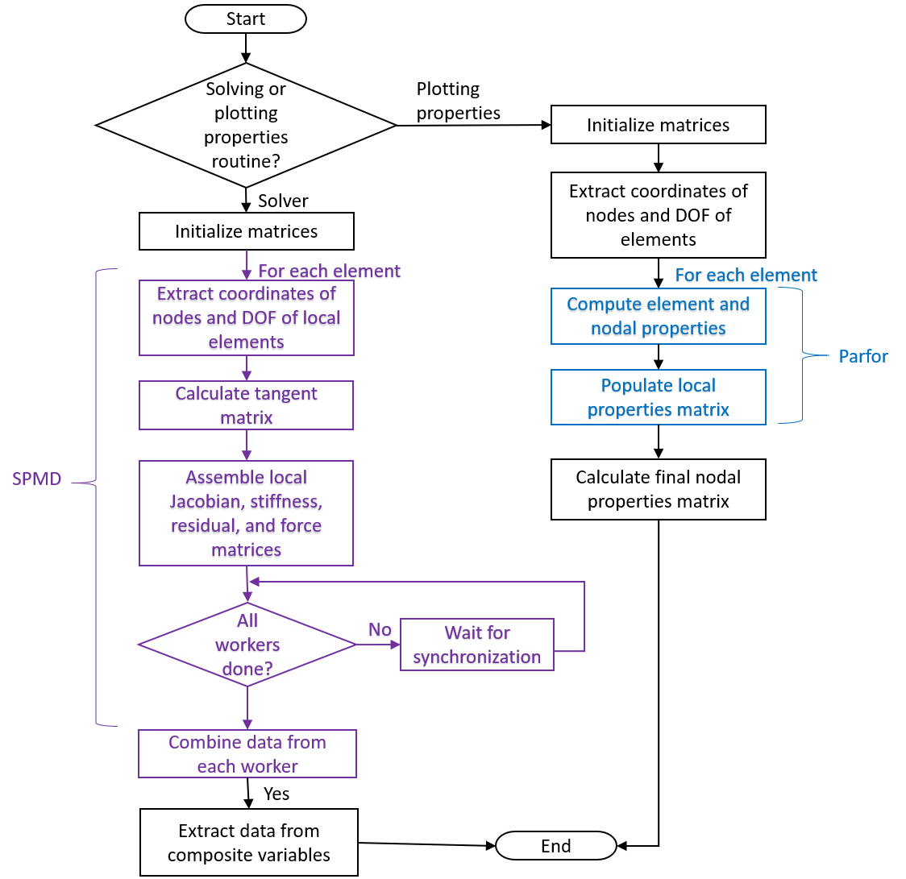

# Statement of Need
Modeling fracture in materials and structures holds immense importance in our efforts to understand how materials fail and hence design more fracture-resistant structures. Among the several theories developed over the last decades, continuum damage mechanics (CDM) studies the behavior of cracks in materials and structures from the viewpoint of continuous stiffness degradation as the crack propagates inside the domain [@lemaitre2012]. CDM simulations are commonly implemented using the finite element method, however the associated computational cost is notoriously elevated. With parallel computing becoming increasingly widespread, it presents an efficient strategy for reducing the high computational cost associated with CDM simulations. This open source code utilizes parallelization techniques for MATLAB in order to significantly accelerate CDM simulations. Building upon previous work by the authors [@saji2024], we develop a parallel MATLAB code and demonstrate the additional efficiency over its serial counterpart. The code is geared for quasi-brittle materials, and it is implemented with two relevant damage models (Mazars' model [@mazars1986] and Geers' model [@geers1998]). Both the unified arc-length (UAL) and Newton--Raphson solvers can be used.

There are several FEM libraries with parallel capabilities publicly available, such as FEniCS [@fenics2024], OOFEM [@mikael_ohman_2020_4339630], Akantu [@Richart2024], OpenSees [@opensees2025], and deal.II [@Arndt_The_deal_II_finite_2021], but they use parallelization strategies such as domain decomposition and/or Message Passing Interface (MPI) and require coding expertise from the user. Our code is unique in its user-accessibility, given that it is written in MATLAB which many users are familiar with, while also implementing parallelization techniques for complex continuum damage mechanics simulations. Also, it features the implementation of a newly developed and robust Unified arc-length solver (UAL) developed in @saji2024, which has demonstrated its superior performance against the force-controlled arc-length (FAL) and Newton--Raphson (NR) solvers both in terms of accuracy and time efficiency. For example, in a 1D bar problem modeled using the non-local gradient damage and a weakened region in the middle (modulus of elasticity is reduced by a factor of two), the UAL solver models the entire non-linear equilibrium path in 0.98 seconds with 97 increments, while the FAL and NR solvers require one to two orders of magnitude more time and increments to trace the same path with a more relaxed convergence tolerance [@saji2024]. The UAL solver can trace equilibrium paths with snap-backs, making it a suitable solver for a wide range of scenarios, which the NR solver cannot capture. Furthermore, the UAL solver is not constrained by the need for small step sizes and relaxed convergence tolerances that limit the usage of the FAL solver. 

# Methodology and Software Implementation
A flowchart of the code's general functionality is shown in \autoref{fig:general_flowchart}. The function on which we focus is the `func_globalstiffness()` function, which calculates and assembles the global stiffness matrix, force vectors, and residual vector. The function also calculates the projection matrices required for contour plotting once the numerical analysis of each load increment is complete.

In MATLAB, parallelization relies on the Parallel Computing Toolbox, in which the user can generate a parallel pool of workers. This parallelization is illustrated in \autoref{fig:gstiffness_flowchart}. In the "solver" mode of the code, the function will assemble global matrices, so we implement the single program multiple data (SPMD) construct in MATLAB since ordered execution and data sharing between workers is needed. In the "plotting properties" mode, we use "parfor" as the loop body is independent, and iterations can be executed in any order. 

# Testing and Results

A symmetric single notch tension (SSNT) problem is used to test the code's effectiveness following @saji2024 and @pantidis2023. In \autoref{fig:threads_totalruntime_HPC} we present the total runtime of a fine (10201 elements) mesh on the New York University Abu Dhabi (NYUAD) High Performance Computing (HPC) cluster, for serial and parallel implementation. From this figure, it is clear that the parallelization exhibits significant cost improvement, with a factor of three reduction in the total runtime of the code for a serial computation to parallel with 8, 16, or 32 threads. Above 32 threads, \autoref{fig:threads_totalruntime_HPC} reveals that additional parallel resources do not provide further improvement for the size of this problem. When pursuing faster runtimes with parallel computing, the overhead costs should be weighed against potential improvement in speed.

{width=55%}

# Acknowledgements
This work was partially supported by the Sand Hazards and Opportunities for Resilience, Energy, and Sustainability (SHORES) Center, funded by Tamkeen under the NYUAD Research Institute. The authors would also like to acknowledge the support of the NYUAD Center for Research Computing for providing resources, services, and staff expertise.

# References
::: {#refs .references}
:::

