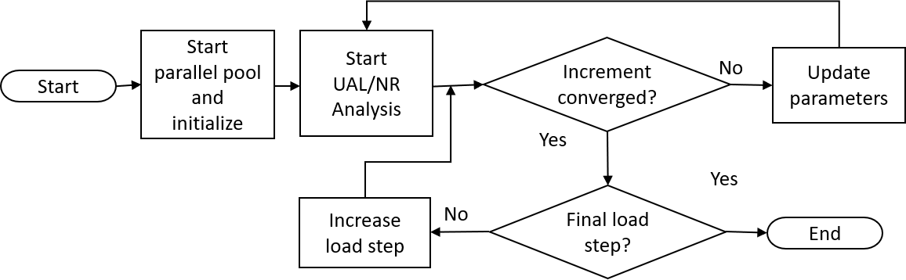
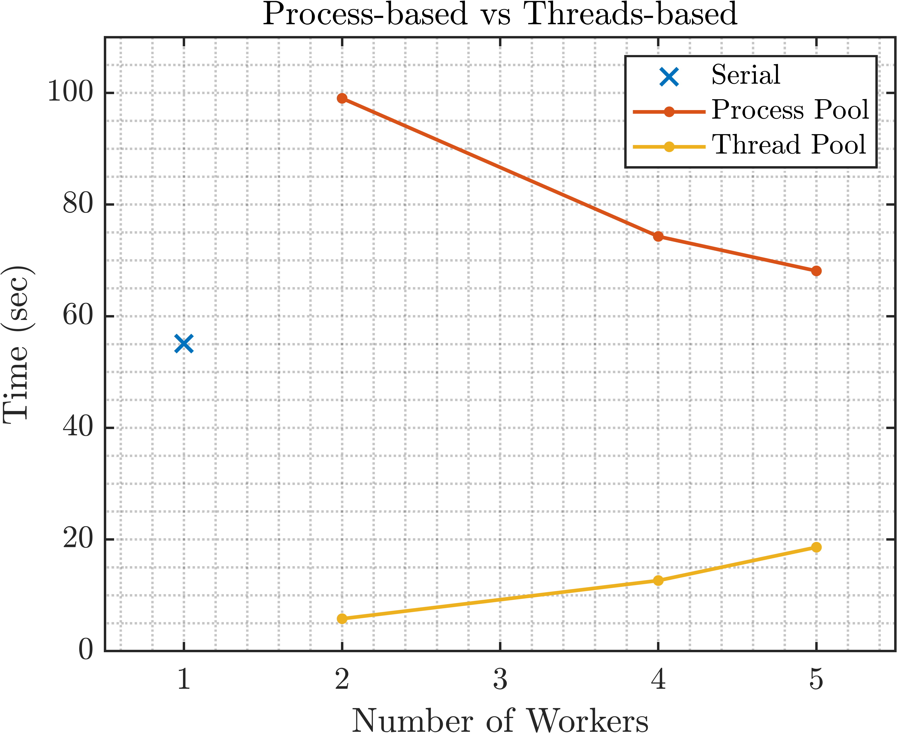

# Statement of Need
Modeling fracture in materials and structures holds immense importance in our efforts to understand how materials fail and hence design more fracture-resistant structures. Among the several theories developed over the last decades, continuum damage mechanics (CDM) studies the behavior of cracks in materials and structures from the viewpoint of continuous stiffness degradation as the crack propagates inside the domain [@lemaitre2012]. CDM simulations are commonly implemented using the Finite Element Method, however the associated computational cost is notoriously elevated. Several remedies have been proposed to reduce this cost, including domain decomposition approaches [@pebrel2008] and adaptive refinement techniques [@li1997]. Compared to these approaches, very few resources are publicly available on implementing parallel computing methods in CDM codes, despite parallelization becoming increasingly widespread. 

This open source code utilizes parallelization techniques for MATLAB in order to significantly accelerate CDM simulations. Building upon previous work by the authors [@saji2024], we develop a parallel MATLAB code and demonstrate the additional efficiency over its serial counterpart. The code is geared for quasi-brittle materials, and it is implemented with two relevant damage models (Mazars’ [@mazars1986] and Geers’ model [@geers1998]). Both the Unified arc-length (UAL) and Newton-Raphson solvers can be used. We address the common issue of parallel code portability across different computing devices, and we demonstrate the scaling of computational savings at smaller mesh sizes. 

There are several FEM libraries with parallel capabilities publicly available, such as FEniCS, OOFEM, Akantu, OpenSees, deal.II, but they use different strategies such as domain decomposition and/or Message Passing Interface (MPI). While such software is extensive and efficient, it requires expertise from the user. Our code is unique in its accessibility given that is written in MATLAB, which many users are familiar with. Also, it features the implementation of a newly developed and robust arc-length solver (UAL) developed in [@saji2024], which has demonstrated its superior performance against the force-controlled arc-length (FAL) and Newton-Raphson (NR) solvers  both in terms of accuracy and time efficiency. 

# Methodology and Software Implementation
A flowchart of the code’s general functionality is shown in \autoref{fig:general_flowchart}. The function on which we focus is the “func_globalstiffness” function, which calculates and assembles the global stiffness matrix, force vectors, and residual vector. The function also calculates the projection matrices required for contour plotting once the numerical analysis of each load increment is complete.

In MATLAB, parallelization relies on the Parallel Computing Toolbox, in which the user can generate a parallel pool of workers which is either process-based or thread-based [@mathworks2024a]. When running a process-based pool, the data for each task is copied to a different location where the task will be executed. In a thread-based pool, the tasks run on the original data. This parallelization is illustrated in \autoref{fig:gstiffness_flowchart}. In the ‘solver’ mode of the code, the function will assemble global matrices, so we implement the Single Program Multiple Data (spmd) construct in MATLAB since ordered execution and data sharing between workers is needed. In the ‘plotting properties’ mode, we use ‘parfor’ as the loop body is independent, and iterations can be executed in any order. 

# Testing and Results
To validate the proposed methodology, the direct tension test problem in the L=50mm configuration reported by [@peerlings1998] is tested and compared as seen in \autoref{fig:test_comparison}. The close agreement between the two sets of results substantiates the accuracy and reliability of the present approach.

{width=65%}

A Symmetric Single Notch Tension (SSNT) problem is used to test the code’s effectiveness following [@saji2024] and [@pantidis2023]. \autoref{fig:schematics} shows the schematic of the analyzed problem, and the reader is referred to [@saji2024] for more numerical details. Three mesh sizes are used: 2601 elements (coarse), 6561 elements (medium), and 10201 elements (fine). The UAL solver is utilized here, but the code can be seamlessly used for the NR method as well which deploys the same “func_globalstiffness” function. The code is tested on 3 computing platforms. The first is a Dell G15 5511 laptop with a 11th Gen Intel(R) Core(TMW) i7-11800H @ 2.30GHz chip and 16 GB of RAM with 8 cores. The second machine is a Dell Precision 5820 Tower Workstation with an Intel(R) Xeon(R) W with 64GB RAM and 4 cores. Finally, the code is tested on the New York University Abu Dhabi (NYUAD) High Performance Computing (HPC) resources. To illustrate the impact of increasing cores, the memory on the cluster was set to a constant 400GB for all numbers of threads.

The results of the coarse mesh analysis on the Dell G15 laptop are shown in \autoref{fig:threads_vs_processes_coarse_dell}, where the serial, parallel process-based, and parallel thread-based implementation of the “func_globalstiffness” are compared for the first 5 iterations of the analysis. We clearly observe that the thread-based environment is significantly faster, both against its serial (3-10x faster) and its process-based counterpart (3-20x faster). This is likely due to the nature of threads running tasks directly on the original data in contrast with the process-based environment where the data of each task is copied elsewhere, and each process runs on the copied data. We also observe that the thread-based environment demonstrates increasing time with more workers, and this is attributed to the coarse mesh where additional parallelization is unnecessary.

{width=80%}

{width=55%}

Next, using the thread-based environment, we compare the performance on the Dell laptop and the workstation across the three mesh-refinement levels. The results are shown in \autoref{fig:laptop_vs_workstation_allmesh}.  We observe that the laptop is considerably faster than the workstation for the coarse mesh, but as the mesh size increases the workstation becomes more efficient. We also observe from \autoref{fig:laptop_vs_workstation_allmesh} that with larger mesh sizes and additional threads, the memory is a limiting factor such that the workstation is more suitable than the laptop due to the larger memory capacity. 

{width=95%}

In \autoref{fig:threads_totalruntime_HPC} we present the total runtime of the fine mesh on the HPC cluster, for serial and parallel implementation. From this figure, it is clear that the parallelization exhibits significant cost improvement, with a 3 times reduction in the total runtime of the code for a serial computation to parallel with 8, 16, or 32 threads. Above 32 threads, \autoref{fig:threads_totalruntime_HPC} reveals that additional parallel resources do not provide further improvement for the size of this problem. When pursuing faster runtimes with parallel computing, the overhead costs should be weighed against potential improvement in speed. 
In \autoref{fig:threads_totalruntime_HPC} we present the total runtime of the fine mesh on the HPC cluster, for serial and parallel implementation. From this figure, it is clear that the parallelization exhibits significant cost improvement, with a 3 times reduction in the total runtime of the code for a serial computation to parallel with 8, 16, or 32 threads. Above 32 threads, \autoref{fig:threads_totalruntime_HPC} reveals that additional parallel resources do not provide further improvement for the size of this problem. When pursuing faster runtimes with parallel computing, the overhead costs should be weighed against potential improvement in speed. 

{width=55%}

Simpler codes will often demonstrate slower runtimes with parallelization. In addition, memory constraints pose a limiting effect on the observed speedup from parallelization, particularly where the mesh is large in comparison with the device memory. Moreover, other tactics used to speed up this code involve efficient plotting techniques, vectorization, and reduced memory usage through sparse matrices.  

# Conclusions
In this article we introduce a parallel-based MATLAB code for continuum damage mechanics simulations. Our code supports the implementation of various non-linear solvers, damage models, local vs non-local formulations, mesh types, and more. A detailed investigation across multiple devices revealed the parallel code achieves 3-10 times speedup over serial execution, with performance plateauing beyond a certain threshold due to overhead. Compared to other sophisticated MPI-based libraries, our approach stands out by offering an easily accessible and user-friendly MATLAB code that is dedicated to damage mechanics, while uniquely integrating the unified arc-length solver which can capture very complex damage patterns and is not available in other platforms. 

# Acknowledgements
This work was partially supported by the Sand Hazards and Opportunities for Resilience, Energy, and Sustainability (SHORES) Center, funded by Tamkeen under the NYUAD Research Institute. The authors would also like to acknowledge the support of the NYUAD Center for Research Computing for providing resources, services, and staff expertise.

# References
::: {#refs .references}
:::

# Supplementary Information
The following figures illustrate the time effect of adding more parallel resources on the Dell G15 laptop and the Dell workstation. We observe that there is a significant improvement from parallelization compared with serial computation regardless of the device, but the laptop demonstrates reduced efficiency with additional workers perhaps due to memory limitations. On the workstation, the larger memory allows additional parallel workers to improve the time even more with the medium and fine mesh sizes. On the coarse mesh, additional resources are not justified since the problem size is much smaller. 

::: {=latex}
\renewcommand{\thefigure}{S\arabic{figure}}
\renewcommand{\figurename}{Figure}
\setcounter{figure}{0}
:::
\begin{figure}[H]
\centering
\includegraphics[width=1\textwidth]{workstation&laptop_allmesh.png}
\caption{Time for the first 5 iterations measured for all 3 mesh sizes on the Dell G15 laptop and Dell workstation. Note that the serial runtime is represented by the x-markers, and the time data is represented on a logarithmic scale for clarity.}
\label{fig:sup1}
\end{figure}

To isolate the effect of additional workers with relation to memory, we test the code on a super fine mesh with 23,048 elements on the HPC cluster with 2, 3, and 10 workers, and with the highest number of workers we compare memory allocation of 64GB and 100GB. The result in \autoref{fig:sup2} demonstrates that additional workers greatly decrease the time taken. The memory is only a limiting factor if it is insufficient, but if it is satisfied then a sufficiently large problem should demonstrate time savings with parallelization.

::: {=latex}
\renewcommand{\thefigure}{S\arabic{figure}}
\renewcommand{\figurename}{Figure}
\setcounter{figure}{1}
:::
\begin{figure}[H]
\centering
\includegraphics[width=0.65\textwidth]{memory_effect_HPC.png}
\caption{For a super fine mesh, the effect of additional workers is compared to increased memory allocation.}
\label{fig:sup2}
\end{figure}
